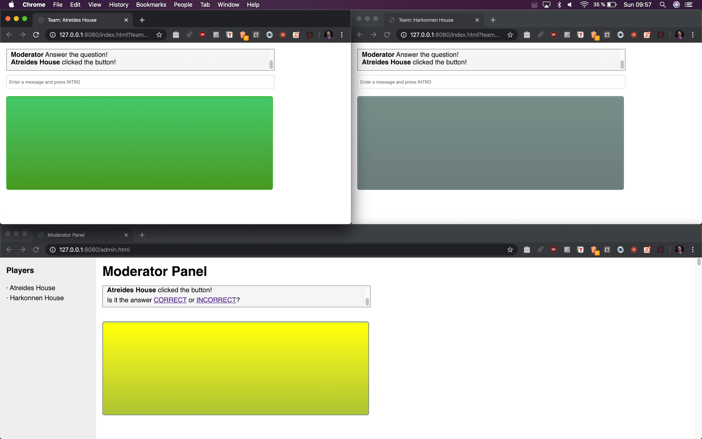

# Neighborhood games



<p align="center">
	<a href='https://ko-fi.com/A838QJC' target='_blank'></a>
	<a href="https://github.com/jmcerrejon/neighborhood-games/blob/master/LICENSE"></a>
	<a href="https://twitter.com/ulysess10"></a>
</p>

## Description

Just a board to manage playing with your neighbours/family/friends using sockets.

**NOTE:** It's just a tool. No games came inside!.

## Features

* Integrated chat between neighbours.

* When moderator make a question, players must to click the yellow button ASAP and answer to win points.

## Installation

On a computer or remote server:

```bash
npm i
npm run start
```

## How to play

The idea is simple:

1. Scream to your neighbours through the window who want to play. You can use any messaging instant chat app, but is less funny.

2. They must join to your *IP/server*.

3. Open a web browser and point to:

- Moderator: /admin.html
- Players: /login.html

### Suggested Games

* Use a microphone and start a quiz game.

* Use a speaker to put any song. You can group songs by section (tv shows, movies, pop) and players must to press the button and answer as fast as they can.

## TODO

✅ First version.

❎ Score.

❎ Remove jQuery.

❎ Redesign the UI using some cool lib.

❎ Localization according with the user web browser.

❎ Save data state.

❎ Multi rooms.

❎ Test.

## DEV

* You can use *DEBUG*: ``` "start-dev": "DEBUG=* nodemon app.js" ```

* On Chrome console command: ``` localStorage.debug = '*'; ```

* The goal of the project is to practice Javascript and new JS features. This is my second app using *socket.io*. 

## Author

👨🏻‍💻 Jose Manuel Cerrejon Gonzalez

✉️ ulysess@gmail.com

📍 Huelva, Spain

📚 MIT License

## Resources

* https://www.bestcssbuttongenerator.com/

Dev with ♥️ using [Node](https://nodejs.org/), [Express](https://expressjs.com/) and [Socket.io](https://socket.io/).