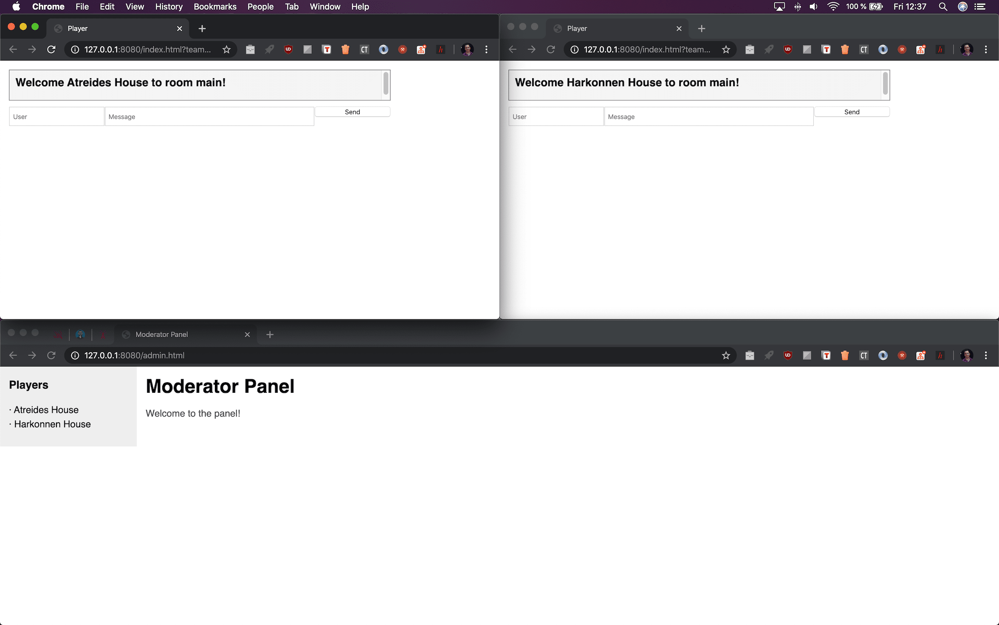

# Neighborhood games



## Description

Just a board to manage playing with your neighbours/family/friends.

**NOTE:** It's just a tool. No games came inside!.

⚠️ **WORK IN PROGRESS**

## Installation

On a computer or remote server:

```bash
npm i
npm run start
```

## How to play

The idea is simple:

1. Scream to your neighbours through the window who want to play. You can use any messaging instant chat app, but is less funny.

2. They must join to your *IP/server*.

3. Open a web browser and point to:

- Moderator: /admin.html
- Players: /login.html

### Suggested Games

* Use a microphone and start a quiz game.

* Use a speaker to put any song. You can group songs by section (tv shows, movies, pop) and players must to press the button and answer as faster as they can.

## TODO

[ ] First version.

[ ] Refactor.

[ ] Score.

[ ] Remove jQuery.

[ ] Localization according with the user web browser.

[ ] Save data state.

[ ] Multi rooms.

[ ] Test.

## DEV

* You can use *DEBUG*: ``` "start-dev": "DEBUG=* nodemon app.js" ```

* On Chrome console command: ``` localStorage.debug = '*'; ```

## Author

👨🏻‍💻 Jose Manuel Cerrejon Gonzalez

✉️ ulysess@gmail.com

📍 Huelva, Spain

📚 MIT License

## Resources

* https://www.bestcssbuttongenerator.com/

Dev with ♥️ using [Node](https://nodejs.org/), [Express](https://expressjs.com/) and [Socket.io](https://socket.io/).